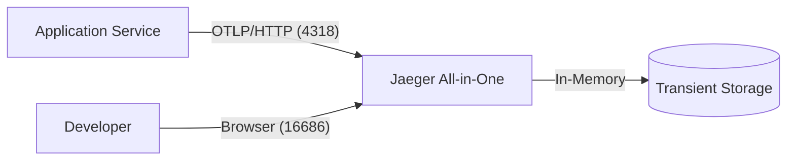

# ADR 001: Distributed Tracing Sidecar Architecture

## Status
Proposed

## Context
Dockstart aims to provide a "one-click" development environment setup. Distributed tracing is essential for modern microservices and complex applications to debug performance issues and understand request flows. We need to define how to integrate Jaeger as a sidecar/service in the generated `docker-compose.yml` and how to configure the application to send traces.

## Decision
We will implement the Distributed Tracing Sidecar using the following architectural decisions:

1.  **Protocol**: Default to **OTLP (OpenTelemetry Protocol) over HTTP (port 4318)**.
    *   *Rationale*: OTLP is the vendor-agnostic industry standard. While Jaeger has native protocols, OTLP ensures compatibility with most modern SDKs and future-proofs the implementation. HTTP is chosen over gRPC for better compatibility with varied environments (e.g., browsers, restricted networks).
2.  **Jaeger Deployment**: Use **Jaeger All-in-One** (`jaegertracing/all-in-one`).
    *   *Rationale*: Dockstart targets development environments. All-in-one is easy to set up, requires minimal resources, and includes the UI, collector, and query service in a single container.
3.  **Storage**: **In-memory**.
    *   *Rationale*: Persistence is not required for typical development sessions. In-memory storage simplifies the setup by removing the need for external databases like Elasticsearch or Cassandra.
4.  **Sampling Strategy**: **100% (Always On)**.
    *   *Rationale*: In a development context, developers usually want to see every trace for the specific scenarios they are testing. Performance overhead is negligible for dev workloads.
5.  **Configuration Method**: **Environment Variables**.
    *   *Rationale*: Environment variables are the standard way to configure OpenTelemetry SDKs and are easily injected via `docker-compose.yml`.

## Technical Specification

### Jaeger Service Configuration
The following ports will be exposed by the Jaeger container:
- `16686`: Jaeger UI (HTTP)
- `4317`: OTLP gRPC receiver
- `4318`: OTLP HTTP receiver

### Injected Environment Variables
For the application service:
- `OTEL_EXPORTER_OTLP_ENDPOINT=http://jaeger:4318`
- `OTEL_SERVICE_NAME={{.ProjectName}}`
- `OTEL_TRACES_SAMPLER=always_on`

## Architecture Diagram

### Legacy Support (Optional/Secondary)
We will maintain the possibility to enable Jaeger Thrift (port `14268`) if specifically requested, but it won't be the default.

## Consequences
- **Pros**:
    - Standardization on OTLP.
    - Simplified development workflow with all-in-one Jaeger.
    - Zero-config required for applications using standard OTLP SDKs.
- **Cons**:
    - In-memory storage means traces are lost on container restart.
    - All-in-one is not suitable for high-load production-like testing.
