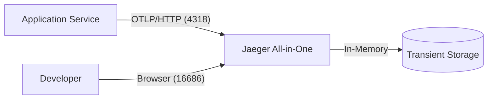

# Research Report: Distributed Tracing Sidecar

## Overview
This report summarizes the research conducted for implementing a distributed tracing sidecar in Dockstart, focusing on Jaeger and OpenTelemetry (OTEL).

## Protocol Selection: OTLP vs. Jaeger Native
After evaluating both options, **OTLP (OpenTelemetry Protocol)** is recommended as the primary protocol.

| Feature | OTLP | Jaeger Native (Thrift) |
|---------|------|------------------------|
| Standard | Industry Standard (CNCF) | Project Specific |
| Portability | High (works with any backend) | Low (Jaeger specific) |
| Future-proof | Yes | Legacy/Maintenance |
| SDK Support | Excellent | Diminishing |

**Recommendation**: Default to OTLP over HTTP (`4318`) for maximum compatibility.

## Deployment Mode: All-in-One vs. Production
For the scope of Dockstart (development environments), **Jaeger All-in-One** is the superior choice.

- **All-in-One**: Combines agent, collector, query, and UI. Uses in-memory storage. Ideal for single-node dev environments.
- **Production**: Distributed architecture using Kafka, Elasticsearch/Cassandra. Overkill for local development.

## Sampling Strategy
In development, we recommend **100% sampling** (`always_on`).
- **Why?** Developers need to see the results of their specific actions. Probabilistic sampling can lead to frustration when a specific request isn't captured during debugging.

## Trace Context Propagation
Context propagation (e.g., `traceparent` headers) is handled by the application's SDK. Dockstart's role is to ensure the `OTEL_SERVICE_NAME` and `OTEL_EXPORTER_OTLP_ENDPOINT` are correctly set so the SDK knows where to send the spans.

## Environment Variable Guide
To enable tracing in a Dockstart-enabled project, the following environment variables should be injected:

```yaml
services:
  app:
    environment:
      - OTEL_EXPORTER_OTLP_ENDPOINT=http://jaeger:4318
      - OTEL_SERVICE_NAME=my-service
      - OTEL_TRACES_SAMPLER=always_on
```

## Architecture Diagram (Textual Representation)

